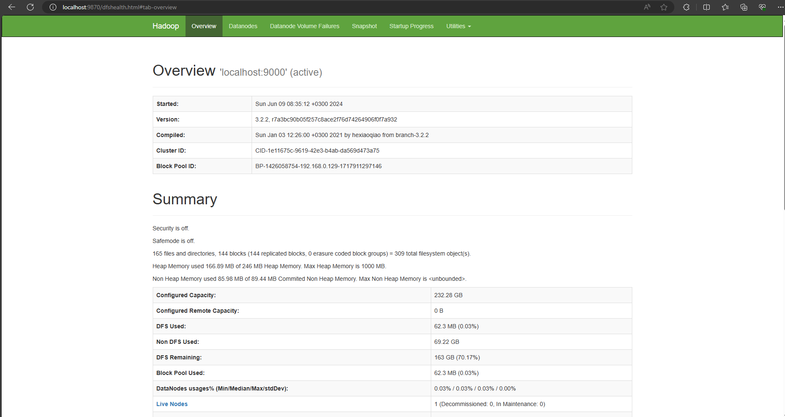
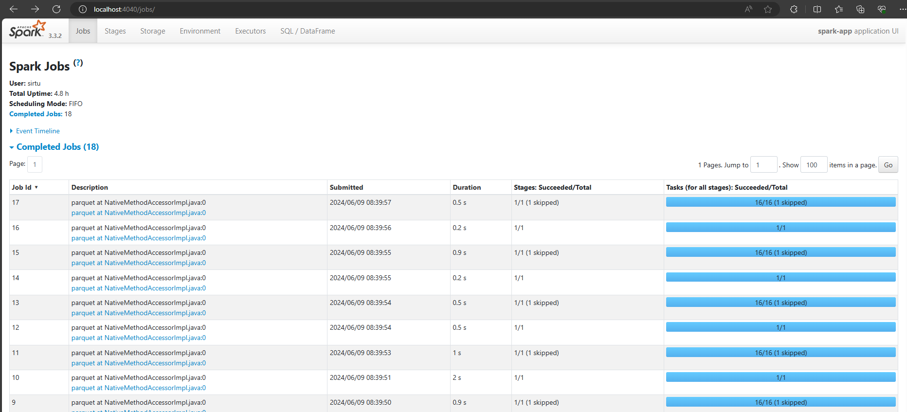
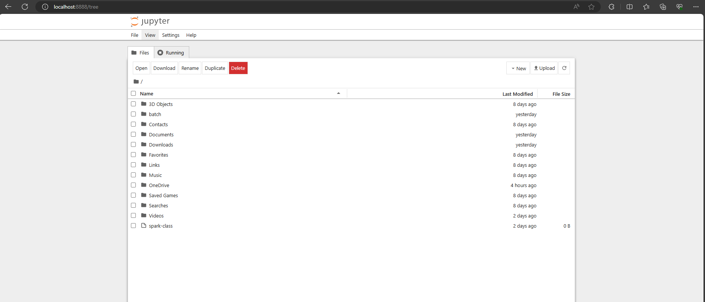
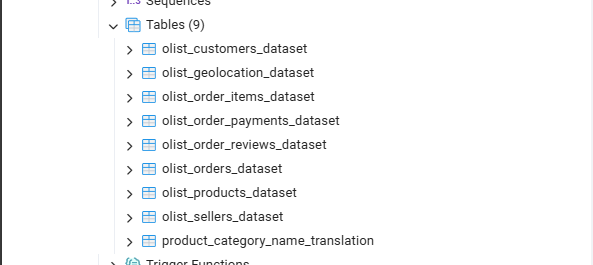
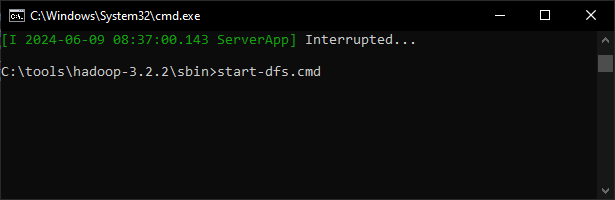
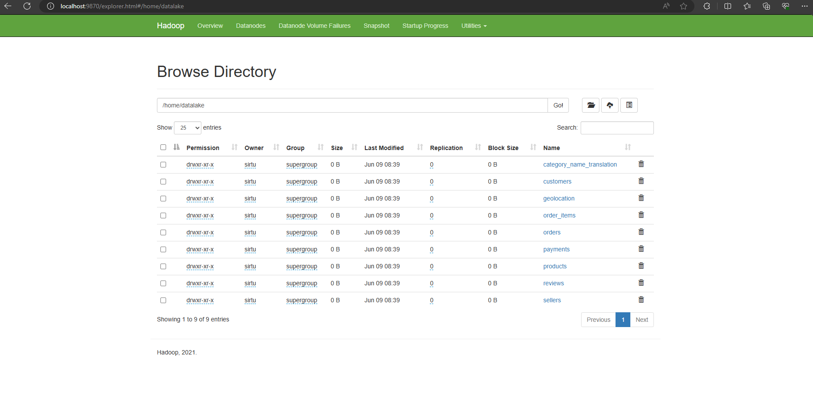
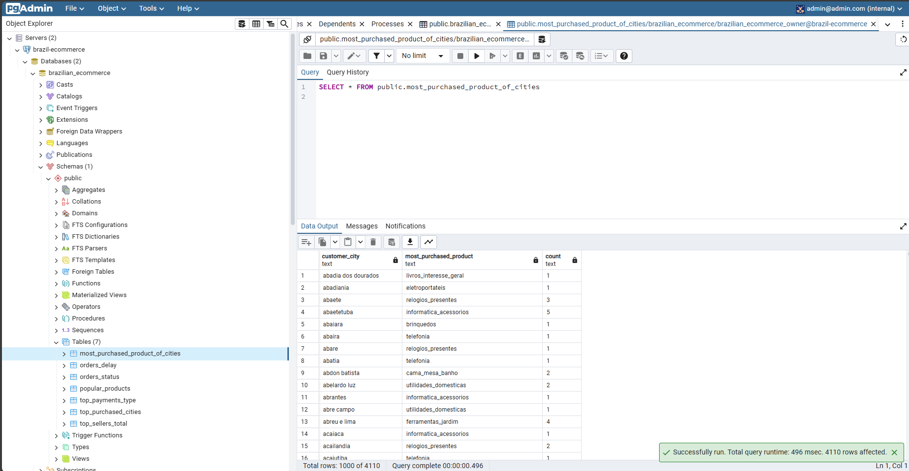

# ETL pipeline pyspark postgreSQL of Brazilian E-Commerce Public Dataset by Olist

Create a simple data pipeline using Pyspark to get data from the local postgres database, then store it in a datalake in HDFS, then process it through Pyspark, and finally load it into the postgresql database on neon.tech

### Prerequisites

The things you need before installing the software.

* Hadoop 3.2.2
* Spark 3.3.2
* Jupyter notebook
* postgresql

[Dataset from Kaggle](https://www.kaggle.com/datasets/olistbr/brazilian-ecommerce/data?select=olist_order_reviews_dataset.csv)

### Installation

Install Hadoop and Spark

Data ingestion to postgres

## Usage

To run:

* Launch HDFS
* 
* 
* Open and run notebooks [extract_data_from_pg.ipynb](./extract_data_from_pg.ipynb) to extract data and load into datalake
* Open and run notebooks [tranform_and_load.ipynb](./tranform_and_load.ipynb) to transform and load to db on neon.tech

### Server

* Hadoop: http://localhost:9870/
* Jupyter notebook: http://localhost:8888/tree
* Spark-jobs: http://localhost:4040/jobs/

## After running

